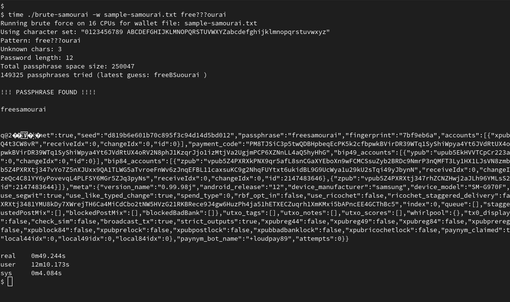

# brute-samourai

## Resumable samourai.txt backup file cracker (written in Go)

Based on [Calin Culianu's brute38](https://github.com/cculianu/brute38), adapter for the Samourai Wallet backup file.

## Usage

```bash
./brute-samourai --charset='xxxxxxx' -w <wallet_file> <length-or-pattern>
./brute-samourai --charset='xxxxxxx' -w <wallet_file> -i <input_file>
```

Arguments:

- charset: the possible passphrase characters. Default: all ASCII letters (upper and lowercase), numbers and space
- wallet_file: file containing the wallet backup. Default: samourai.txt
- length: number of passphrase characters. Default: 4
- pattern: pattern of passphrase. Example: th?p?ssphr?s?
- input_file: instead of specifying length or pattern, a file containing passphrases can be used

A default `sample-samourai.txt` wallet is provided with passphrase **freesamourai**.  
This command:

```bash
./brute-samourai -w sample-samourai.txt free???ourai
```

Should find it in about a minute.


